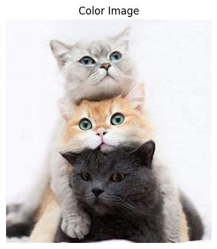
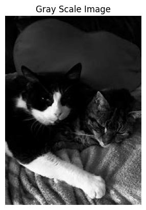
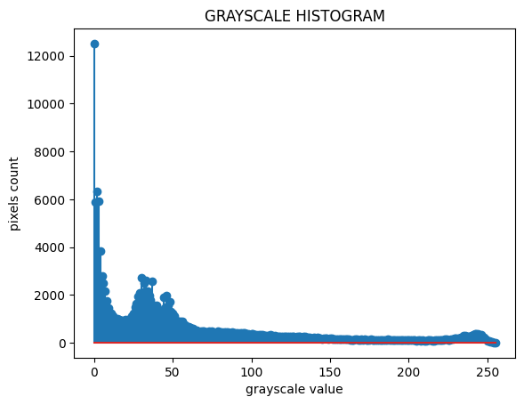
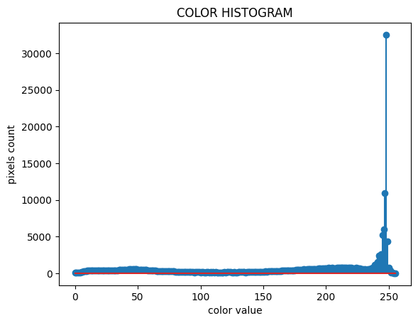
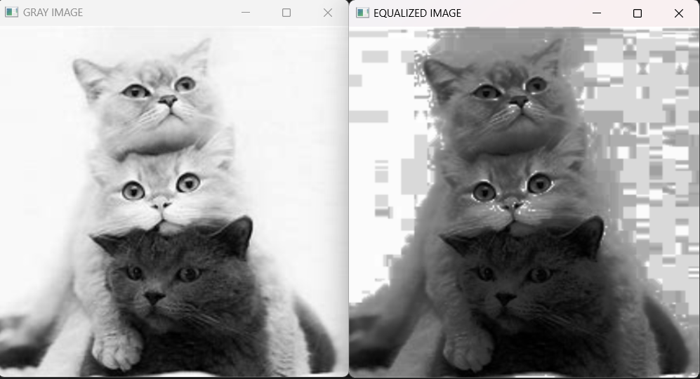

# Histogram and Histogram Equalization of an image
## Aim
To obtain a histogram for finding the frequency of pixels in an Image with pixel values ranging from 0 to 255. Also write the code using OpenCV to perform histogram equalization.

## Software Required:
Anaconda - Python 3.7

## Algorithm:
### Step1:
Read the gray and color image using imread()

### Step2:
Print the image using imshow().


### Step3:
Use calcHist() function to mark the image in graph frequency for gray and color image.

### step4:
Use calcHist() function to mark the image in graph frequency for gray and color image.

### Step5:
The Histogram of gray scale image and color image is shown.


## Program:
```python
# Developed By: Kavinraja D
# Register Number: 212222240047


# Write your code to find the histogram of gray scale image and color image channels.
import cv2
import matplotlib.pyplot as plt
gray_image = cv2.imread("black.jpeg")
color_image = cv2.imread("colour.jpg",-1)
cv2.imshow("Gray Image",gray_image)
cv2.imshow("Colour Image",color_image)
cv2.waitKey(0)
cv2.destroyAllWindows()


# Display the histogram of gray scale image and any one channel histogram from color image
import matplotlib.pyplot as plt 
grayscale_image=cv2.imread("black.jpeg")
colourscale_image=cv2.imread("colour.jpg")
hist=cv2.calcHist(grayscale_image,[0],None,[255],[0,255])
hist1=cv2.calcHist(colourscale_image,[1],None,[255],[0,255])
plt.figure()
plt.title("Histogram")
plt.xlabel("grayscale")
plt.ylabel("pixel count")
plt.stem(hist)
plt.show()
plt.xlabel("colour scale")
plt.ylabel("pixel count")
plt.stem(hist1)
plt.show()


# Write the code to perform histogram equalization of the image. 
import cv2
import matplotlib.pyplot as plt 
gi=cv2.imread("black.jpeg",0)
colorscale=cv2.imread("colour.jpg")
g=cv2.resize(gi,(500,400))
equ=cv2.equalizeHist(gi)
cv2.imshow("Grey Scale",g)
cv2.imshow("Equalization",equ)
cv2.waitKey(0)
cv2.destroyAllWindows()


```
## Output:
### Input Grayscale Image and Color Image




### Histogram of Grayscale Image and any channel of Color Image




### Histogram Equalization of Grayscale Image.



## Result: 
Thus the histogram for finding the frequency of pixels in an image with pixel values ranging from 0 to 255 is obtained. Also,histogram equalization is done for the gray scale image using OpenCV.
